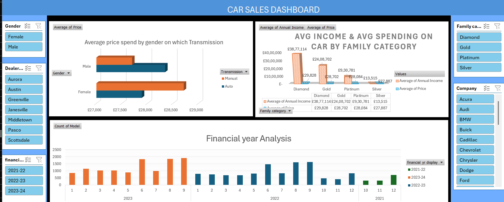
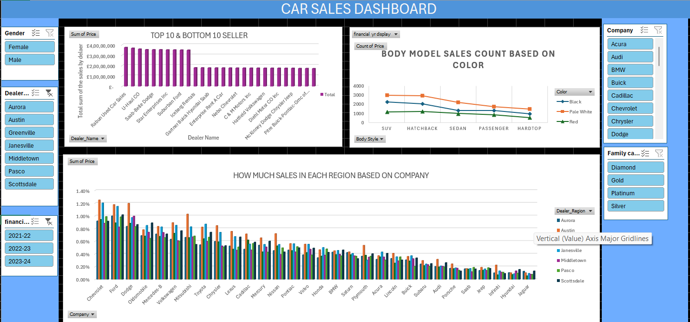

# car-sales-data-analysis
Car Sales Analysis using Excel, SQL, and Power BI
# Car Sales Data Analysis Dashboard

## Project Overview
This project analyses car sales data using Excel and SQL to generate business insights. The dataset was cleaned, transformed, and visualised using pivot tables and interactive dashboards.

## Tools Used
- Microsoft Excel
- Pivot Tables
- Excel Dashboard
- SQL
- Data Cleaning
- Data Analysis

## Project Features
- Cleaned and prepared raw dataset
- Created pivot tables for analysis
- Built interactive Excel dashboard
- Analysed financial year trends
- Analysed customer income and spending patterns
- Used SQL queries to analyse sales data

## Dashboard Preview

### Main Dashboard

### Financial Analysis Dashboard

## Files Included
- car-sales-dashboard.xlsx → Full Excel project with raw data, pivot tables, and dashboards
- car-sales-analysis.sql → SQL queries used for analysis
- Dashboard screenshots → Dashboard preview images

## Skills Demonstrated
- Data Cleaning
- Data Analysis
- Dashboard Development
- Data Visualization
- SQL Query Writing
- Excel Pivot Tables

## Author
Meena Sathiya  
Graduate Data Analyst  
LinkedIn: https://www.linkedin.com/in/meenasathiya/
